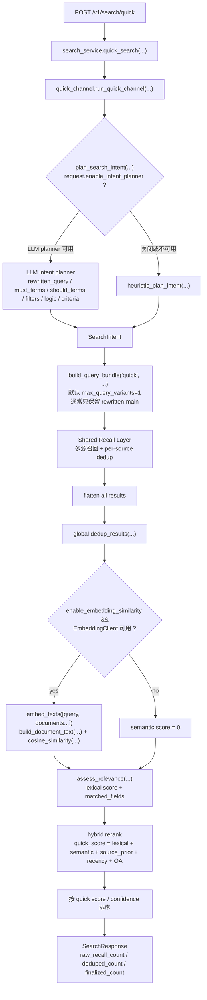
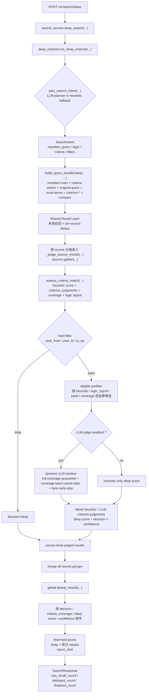
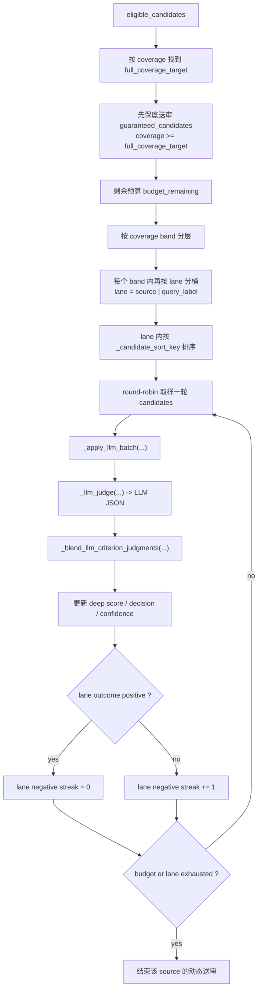

# Quick / Deep 检索流程架构图

本文基于当前代码实现梳理 `quick` 与 `deep` 两条检索链路，覆盖入口、intent planning、query bundle、shared recall layer、provider runtime、去重、排序与 deep judge。

代码阅读范围主要包括：

- `app/api/routes.py`
- `app/services/search_service.py`
- `app/services/quick_channel.py`
- `app/services/deep_channel.py`
- `app/services/search_common.py`
- `app/connectors/base.py`
- `app/services/provider_registry.py`
- `app/services/provider_runtime.py`
- `app/connectors/openalex.py`
- `app/connectors/semanticscholar.py`
- `app/connectors/arxiv.py`
- `config/config.yaml`

## 1. Shared Recall Layer

`quick` 和 `deep` 在“多源召回”这一层共用同一套骨架，只是在 query bundle 和后续排序/判定上分叉。

```mermaid
flowchart LR
    A["QueryBundleItem[]<br/>build_query_bundle(...)"] --> B["recall_results_by_source(...)<br/>resolve limit_per_source<br/>get_clients_for_mode(...)"]
    B --> C["BaseSourceClient.batch_search(mode, query_bundle, limit)"]
    C --> D{"ProviderRuntime.batch_results<br/>concurrent / sequential"}
    D --> E["execute_mode_search(...)<br/>normalize_query + render_query_for_mode(...)"]
    E --> F{"run_results_operation(...)<br/>Redis result cache"}
    F -->|cache hit| J["attach RetrievalTrace<br/>mode / query_label / rendered_query"]
    F -->|cache miss| G["runtime.request(...)<br/>retry + backoff + rate limit + lock"]
    G --> H["Provider API<br/>OpenAlex / Semantic Scholar / arXiv / CORE / IEEE ..."]
    H --> I["Connector normalize<br/>PaperResult[]"]
    I --> J
    J --> K["per-source dedup<br/>dedup_results(...)"]
    K --> L["results_by_source + used_sources + raw_recall_count"]
```

这一层的几个关键点：

- provider 选择来自 `provider_registry.get_clients_for_mode(...)`
- `BaseSourceClient` 统一处理 batch search、query render、retrieval trace
- `ProviderRuntime` 统一处理批调度、Redis 结果缓存、请求级限流/锁、429 重试
- deep 模式允许 provider 自定义 `render_query_for_mode(...)`，例如 OpenAlex / Semantic Scholar 会压短 query，arXiv 会转换成 `all:...` 的布尔检索式

## 2. Quick 检索流程

当前 `quick` 的目标是“快速召回 + 轻量 hybrid rerank”。

Quick 通道当前的实现特征：

- 入口很薄，真正的排序逻辑集中在 `app/services/quick_channel.py`
- query planning 和 shared recall 仍复用 `search_common.py`
- semantic 分数不是 provider 原生语义检索，而是本地在召回后调用 `EmbeddingClient` 做 query-document embedding rerank
- 评分主公式由 `retrieval.quick.hybrid_weights` 控制，当前默认权重为 lexical `0.45`、semantic `0.35`、source_prior `0.1`、recency `0.05`、open_access `0.05`

## 3. Deep 检索流程

当前 `deep` 的目标是“复杂组合查询 + criterion-aware 验证 + 动态 LLM judge”。

Deep 通道当前的实现特征：

- `build_query_bundle('deep')` 会根据 `logic` 和 `criteria` 动态扩展 query variants
- `deep` 的 recall 与 `quick` 共用统一接口，但 provider 可以按 deep 模式定制 query render
- heuristic 预评分先计算 `criterion_judgments`、`criteria_coverage`、`deep_logic_signal`
- LLM judge 不是全局一次性判定，而是“按 source 分组、逐篇判断”
- 最终结果不是简单返回全部候选，而是先排序，再经过 `_finalize_deep_results(...)` 做 hard prune

## 4. Deep Judge 动态送审窗口

`deep` 的复杂度主要集中在 `_run_dynamic_llm_window(...)`，它不是固定的 “每源 Top-N 一刀切”。

这里的控制目标是：

- 先覆盖最有希望满足全部 required criteria 的候选
- 再在不同 `query variant` 车道之间轮转，避免单一路径吃光预算
- 对连续低产出的 lane 提前停送审，减少 LLM 浪费

当前关键默认参数来自 `config/config.yaml`：

- `retrieval.deep.max_query_variants = 4`
- `retrieval.deep.max_query_variants_complexity_bonus = 4`
- `retrieval.deep.limit_per_source_default = 10`
- `retrieval.deep.llm_top_n_per_source = 6`
- `retrieval.deep.max_dynamic_llm_top_n_per_source = 14`
- `retrieval.deep.heuristic_weight = 0.3`
- `retrieval.deep.llm_weight = 0.7`
- `retrieval.deep.keep_threshold = 0.6`
- `retrieval.deep.maybe_threshold = 0.35`

## 5. 代码职责映射

| 模块 | 当前职责 |
| --- | --- |
| `app/api/routes.py` | 暴露 `/v1/search/quick`、`/v1/search/deep` API |
| `app/services/search_service.py` | channel dispatch，转发到 quick / deep 通道 |
| `app/services/search_common.py` | intent planning、criteria 生成、query bundle、shared recall、去重、基础 lexical / criterion 评分 |
| `app/services/quick_channel.py` | quick 的 hybrid rerank 与最终排序 |
| `app/services/deep_channel.py` | deep 的 heuristic judge、LLM judge、动态送审窗口、最终 hard prune |
| `app/services/provider_registry.py` | 根据 mode / source / public_only 挑选 provider |
| `app/connectors/base.py` | 统一 batch search、mode-specific query render、结果缓存入口、retrieval trace 注入 |
| `app/services/provider_runtime.py` | provider 批调度、Redis 结果缓存、请求级限流/锁、429 重试/backoff |
| `app/connectors/*.py` | provider API 调用与 `PaperResult` 标准化 |

## 6. 一句话总结

- `quick` 是一条“共享召回层 + hybrid rerank”的轻量排序链路
- `deep` 是一条“共享召回层 + criterion-aware heuristic/LLM judge + 动态送审窗口 + 最终 hard prune”的深度验证链路
- 两条链路的共用底座主要在 `search_common.py`、`BaseSourceClient` 和 `ProviderRuntime`
